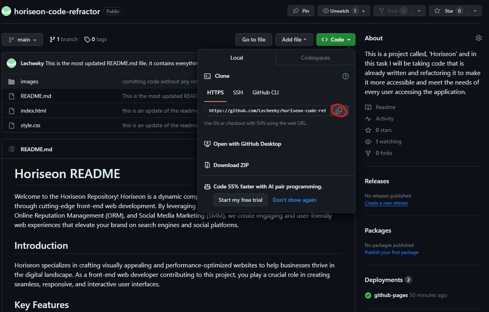

# Horiseon README

Welcome to the Horiseon Repository! Horiseon is a dynamic company dedicated to enhancing brand visibility through cutting-edge front-end web development. By leveraging the power of Search Engine Optimization (SEO), Online Reputation Management (ORM), and Social Media Marketing (SMM), we create engaging and user-friendly web experiences that elevate your brand on search engines and social platforms.

## Introduction
Horiseon specializes in crafting visually appealing and performance-optimized websites to help businesses thrive in the digital landscape. As a front-end web developer contributing to this project, you play a crucial role in creating seamless, responsive, and interactive user interfaces.

## Key Features 

1. Search Engine Optimization (SEO) <a href="#search-engine-optimization">Search Engine Optimization</a>

Implement SEO best practices to ensure websites rank higher on search engines.
Optimize HTML, CSS, and JavaScript to enhance page performance and user experience.

2. Online Reputation Management (ORM) <a href="#online-reputation-management">Online Reputation Management</a>

Integrate features that support online reputation monitoring and management.
Implement responsive design to ensure a positive user experience across devices.

3. Social Media Marketing (SMM) <a href="#social-media-marketing">Social Media Marketing</a>

Integrate social media sharing features to amplify brand presence.
Create visually engaging and shareable content for social media platforms.

#   Benefits with Horiseon

Lead Generation - Inbound strategies for lead generation require less work for your business, bringing customers directly to your website.

Brand Awareness - Users find your business through paid and organic searches, increasing the search ranking and visibility for your business.

Cost Management - As the search ranking for your business increases, your advertising costs decrease, and you no longer need to advertise your page.

## Getting Started (Installation)

Cloning and accessing the Repository:

1. With your terminal, create a new folder and cd into the folder

2. navigate to the code section of this github page

3. copy our link or use the one provided here and select a folder you would like to put your code in
[https://lecheeky.github.io/horiseon-code-refractor/]

4. type git clone [https://lecheeky.github.io/horiseon-code-refractor/] into the folder you want access to and
open with any code editor of your choice

## Contact Information

For inquiries or assistance, please contact our development team:

Email: thadjlakehal@gmail.com
Issue Tracker: GitHub Issues

Thank you for your contribution to Horiseon's Front-End Web Development! Together, let's create exceptional digital experiences that elevate brands

## License

Made with ❤️️ by Horiseon © 2019 Horiseon Social Solution Services, Inc.
